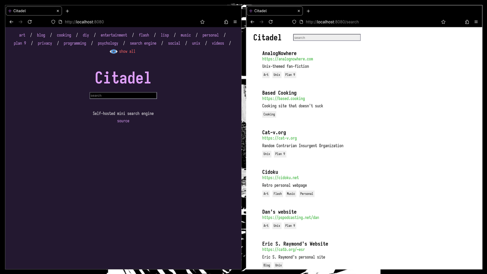

# Citadel

A self-hosted mini search engine



The point is to allow other users to connect
to other similar websites in an organic way,
similar to how webrings work.
It's not fast and it's not scalable,
it's only meant to show a small number of
recommended sites.

## Features
- Minimal requirements
- Search by queries / tags
- All sites stored in a toml file (config.toml)
- Customizable themes (see [themes](themes))

## Setup
Compile the project using `make`
and add the program as a [service](systemd-example.service).

The working directory should have a toml file
alongside a themes folder:

```
working_directory
├── config.toml
└── themes/
    └── mytheme.toml
```

Modify the values inside .toml files accordingly.
